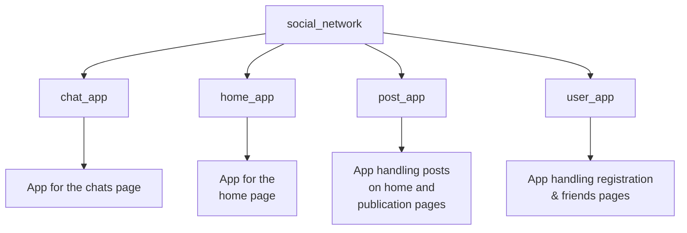

# Social Network

*Read this in other languages: [English](README.md), [Українська](README.uk.md).*

## Project Goal
The project is developed as a demonstration framework for a multi-user, social network-style platform built on Django. Its main goal is to visually showcase architectural approaches to combining complex database relationships with an asynchronous infrastructure within a single application.

**Why this project is useful for beginners:**
* **Production-Ready Data Architecture:** It showcases how to structure complex entity relationships using Django ORM (`OneToOne`, `ForeignKey`, and `ManyToMany`) so you can see a well-modeled database in action.
* **Built-in Real-Time Features:** With **Django Channels** pre-configured, the project provides a solid foundation for handling WebSockets and instant data exchange out of the box.
* **Configured Asynchronous Stack:** Full integration with the **Daphne** ASGI server ensures that synchronous and asynchronous components run smoothly side by side.
* **Secure Authentication:** It utilizes standard Django sessions to handle user authentication, seamlessly protecting both traditional web views and real-time data streams.

## Team Members

| Contributor | GitHub |
| :--- | :--- |
| **Sofiia Tokarchuk** | [@SofiiaTokarchuk](https://github.com/SofiiaTokarchuk) |
| **Roman Redkin** | [@RomanRedkin](https://github.com/RomanRedkin) |
| **Misha Balkovyi** | [@rainofpain](https://github.com/rainofpain) |
| **Sviatoslav Martynenko** | [@SviatMartynenko](https://github.com/SviatMartynenko) |

## Navigation
- [Installation and Running](#installation-and-running)
- [Project structure](#project-structure)
- [Technologies used](#technologies-used)
- [Documentation](#documentation)
- [Project summary](#project-summary)

## Installation and Running

#### 1. Clone the repository
```
git clone https://github.com/SofiiaTokarchuk/SocialNetwork.git
```
#### 2. Create `venv` using Python 3.12 and activate it
For Windows Bash
```
py -3.12 -m venv venv
```
```
source venv/Scripts/activate
```
For MacOS/Linux
```
python3.12 -m venv venv
```
```
source venv/bin/activate
```
#### 3. Install necessary requirements
For Windows Bash
```
pip install -r requirements.txt
```

For MacOS/Linux
```
pip3 install -r requirements.txt
```

#### 4. Navigate to the main project directory containing the ```manage.py``` file
```
cd social_network
```

#### 4. Start the local server
For Windows
```
python manage.py runserver
```
For MacOS/Linux
```
python3 manage.py runserver
```
## Project Structure
>[Back to top](#social-network)


## Technologies used
>[Back to top](#social-network)

- **[Python](https://www.python.org/)** — programming language used for creating the backend of the site
- **[Django](https://docs.djangoproject.com/en/5.0/)** — web framework used to build the project
- **[JavaScript](https://developer.mozilla.org/en-US/docs/Web/JavaScript)** — main programming language used to enhance the user interface
- **[Daphne](https://pypi.org/project/daphne/)** — An ASGI server used to handle asynchronous requests and WebSockets.
- **[Channels](https://pypi.org/project/channels/)** — A Django extension used to handle real-time features and WebSocket routing.

- **[HTML](https://developer.mozilla.org/en-US/docs/Web/HTML)/[CSS](https://developer.mozilla.org/en-US/docs/Learn/CSS)** — languages for website layout, structure, and styling

- **[Figma](https://help.figma.com/hc/en-us)** — online service used for planning the site's design
- **[SQLite3](https://www.sqlite.org/docs.html)** - database used for the site development

## Documentation

## Project summary

This project served as a great hands-on introduction to Django, focusing on the principles of combining synchronous and asynchronous processes within a single product. It provides an excellent practical foundation for developing new, more complex Django projects.
