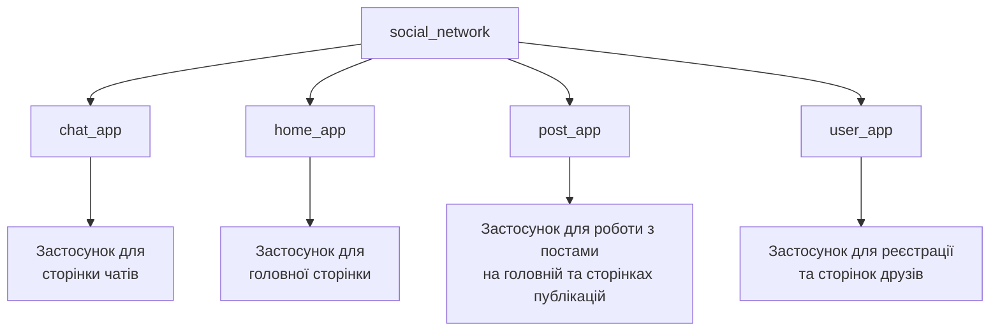

# Social Network

*Read this in other languages: [English](README.md), [Українська](README.uk.md).*

### Мета створення проєкту
Проєкт розроблений як демонстраційний каркас багатокористувацької платформи типу «соціальна мережа» на базі Django. Його головна мета — наочно показати архітектурні підходи при поєднанні складних зв'язків у базі даних та асинхронної інфраструктури в межах одного застосунку.

**Чим проєкт корисний для початківця:**
* **Готова архітектура даних:** У проєкті вже спроєктовано та реалізовано комплексні взаємозв'язки між сутностями з використанням зв'язків Django ORM (`OneToOne`, `ForeignKey`, `ManyToMany`), що дає змогу одразу працювати з готовою структурою БД.
* **Підтримка Real-Time функціоналу:** Інтеграція **Django Channels** забезпечує готову інфраструктуру для роботи з WebSockets та обміну даними в реальному часі.
* **Налаштована асинхронна інфраструктура:** Проєкт повністю адаптований під роботу з ASGI-сервером **Daphne**, що забезпечує стабільну паралельну роботу синхронних та асинхронних компонентів.
* **Автентифікація та захист даних:** Реалізовано готові механізми перевірки користувачів через сесії Django, які автоматично захищають як звичайні сторінки, так і функції обміну даними в реальному часі.

### Склад команди

| Розробник | GitHub |
| :--- | :--- |
| **Софія Токарчук** | [@SofiiaTokarchuk](https://github.com/SofiiaTokarchuk) |
| **Роман Редькін** | [@RomanRedkin](https://github.com/RomanRedkin) |
| **Міша Балковий** | [@rainofpain](https://github.com/rainofpain) |
| **Святослав Мартиненко** | [@SviatMartynenko](https://github.com/SviatMartynenko) |

## Навігація
- [Встановлення та запуск](#встановлення-та-запуск)
- [Структура проєкту](#структура-проєкту)
- [Використані технології](#використані-технології)
- [Документація](#документація)
- [Висновок](#висновок)

## Встановлення та запуск

#### 1. Клонувати репозиторій
```
https://github.com/SviatMartynenko/SocialNetwork.git
```

#### 2. Створити віртуальне оточення `venv` за версії Python 3.12 та активувати його
Для Windows Bash
```
py -3.12 -m venv venv
```
```
source venv/Scripts/activate
```
Для MacOS/Linux
```
python3.12 -m venv venv
```
```
source venv/bin/activate
```

#### 3. Встановити необхідні залежності

Для Windows Bash
```
pip install -r requirements.txt
```

Для MacOS/Linux
```
pip3 install -r requirements.txt
```
#### 4. Перейти до головної директорії проєкту, що містить файл ```manage.py```
```
cd social_network
```

#### 5. Запустити локальний сервер

Для Windows
```
python manage.py runserver
```

Для MacOS/Linux
```
python3 manage.py runserver
```

## Структура проєкту
>[Повернутися до початку](#social-network)


## Використані технології
>[Повернутися до початку](#social-network)

- **[Python](https://www.python.org/)** — мова програмування, що використовується для створення бекенду сайту
- **[Django](https://docs.djangoproject.com/en/5.0/)** — вебфреймворк, на базі якого побудовано проєкт
- **[JavaScript](https://developer.mozilla.org/en-US/docs/Web/JavaScript)** — основна мова програмування для розширення можливостей користувацького інтерфейсу
- **[Daphne](https://pypi.org/project/daphne/)** — ASGI-сервер, який використовується для обробки асинхронних запитів та WebSockets
- **[Channels](https://pypi.org/project/channels/)** — розширення для Django, яке використовується для реалізації функцій реального часу та маршрутизації WebSockets
- **[HTML](https://developer.mozilla.org/en-US/docs/Web/HTML)/[CSS](https://developer.mozilla.org/en-US/docs/Learn/CSS)** — мови для верстки, структурування та стилізації сайту
- **[Figma](https://help.figma.com/hc/en-us)** — онлайн-сервіс, який використовувався для планування дизайну сайту
- **[SQLite3](https://www.sqlite.org/docs.html)** — база даних, яка використовувалася під час розробки сайту

## Документація

## Висновок

Цей проєкт став чудовою ознайомчою практикою з роботи з Django, у ході розробки якої було розібрано принципи поєднання синхронних та асинхронних процесів в одному продукті. Він є чудовою практичною базою для розробки нових, більш складних проєктів на Django.

